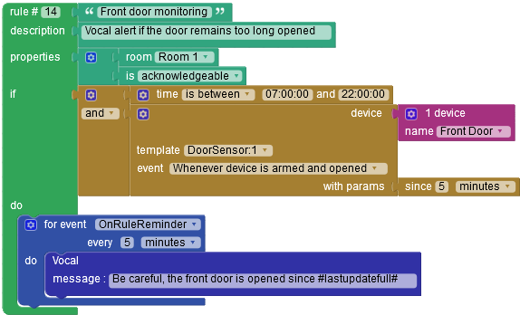

#  Vera-Plugin-RulesEngine

A rules engine for [getVera](http://getvera.com/) Home Controller (VeraPlus, VeraEdge, Vera3, VeraLite) and [openLuup](https://github.com/akbooer/openLuup)
- allows to create visually rules (with [Blockly](https://github.com/google/blockly))
- management of complex conditions
- customizable

**Compatible with UI5 & UI7. Rules are editable only with [AltUI](http://forum.micasaverde.com/index.php/board,78.0.html)**

More informations here :
- http://forum.micasaverde.com/index.php/topic,34489.0.html
 

